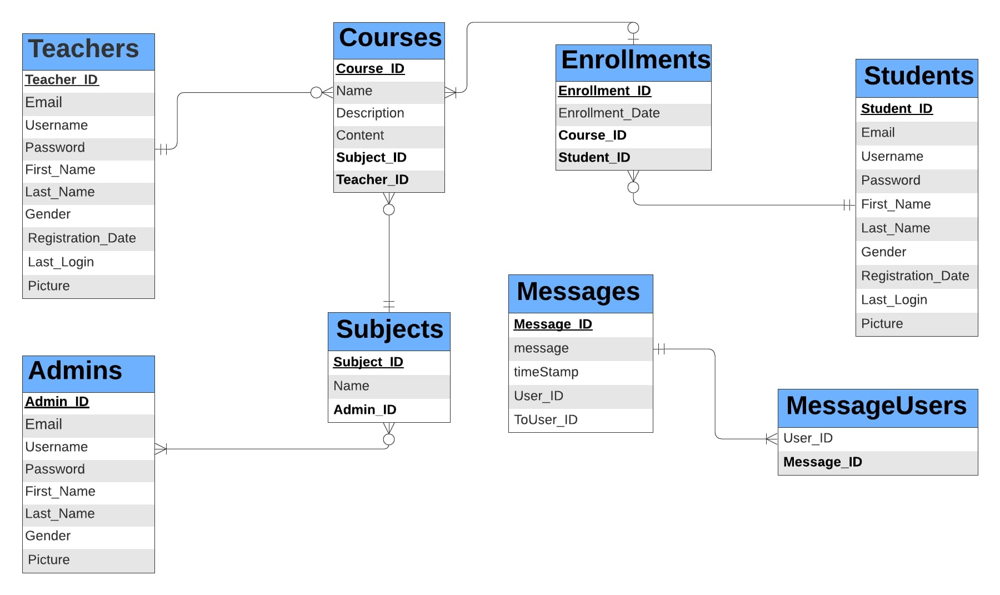
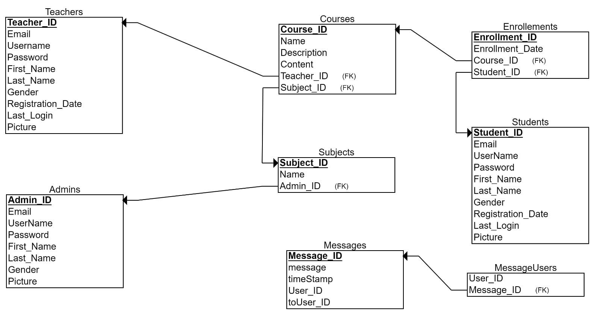

# 🎓 E-Learning System

A desktop-based **Java e-learning platform** designed around three user roles: **Admin, Teacher, and Student**. The application uses Java Swing/AWT for the desktop interface and MySQL for persistent data.

## 🖼️ System Design

### ER Diagram

### Relational Schema

These diagrams document the database structure and the relationships between the main entities.

## ✨ Overview

The system provides a complete learning workflow:

- **Admin:** manages subjects, users, courses, and administrator accounts.
- **Teacher:** creates and manages courses and views enrolled students.
- **Student:** registers, enrolls in courses, studies course content, withdraws from courses, views participants, and communicates with course participants.

## 🧩 Main Modules

| Module | Responsibilities |
| --- | --- |
| Admin | Account management, subjects, teachers, students, courses, admin management |
| Teacher | Registration, login, profile, course creation/update, student viewing |
| Student | Registration, login, enrollment, study, withdrawal, participants, messaging |

## 🛠️ Technology Stack

- **Language:** Java
- **Desktop UI:** Swing / AWT
- **Database:** MySQL
- **Local server environment:** WAMP
- **IDE:** NetBeans-compatible Java project

## 🚀 Setup

1. Install a Java JDK/JRE and NetBeans (or another compatible Java IDE).
2. Install and start MySQL through your local WAMP environment.
3. Create the project database using the SQL file included in the repository.
4. Configure the application's database connection for your local MySQL credentials.
5. Build and run `LoadingScreen.java` or `Main.java` from the IDE.

> **Security note:** use your own local database credentials. Do not commit passwords, API keys, or other secrets to the repository.

## 📌 Project Status

Completed academic desktop application project.

## 👨‍💻 Author

**Dreamjain** — [GitHub](https://github.com/Dreamjain)
